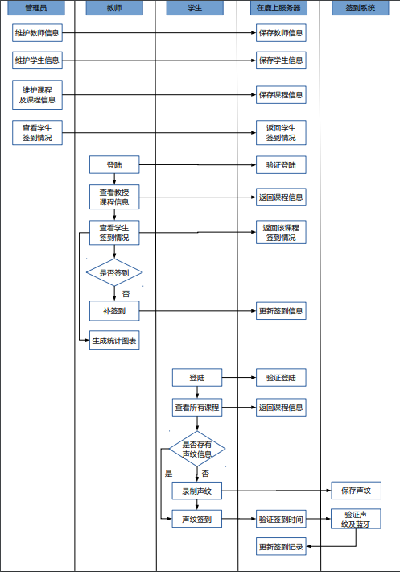
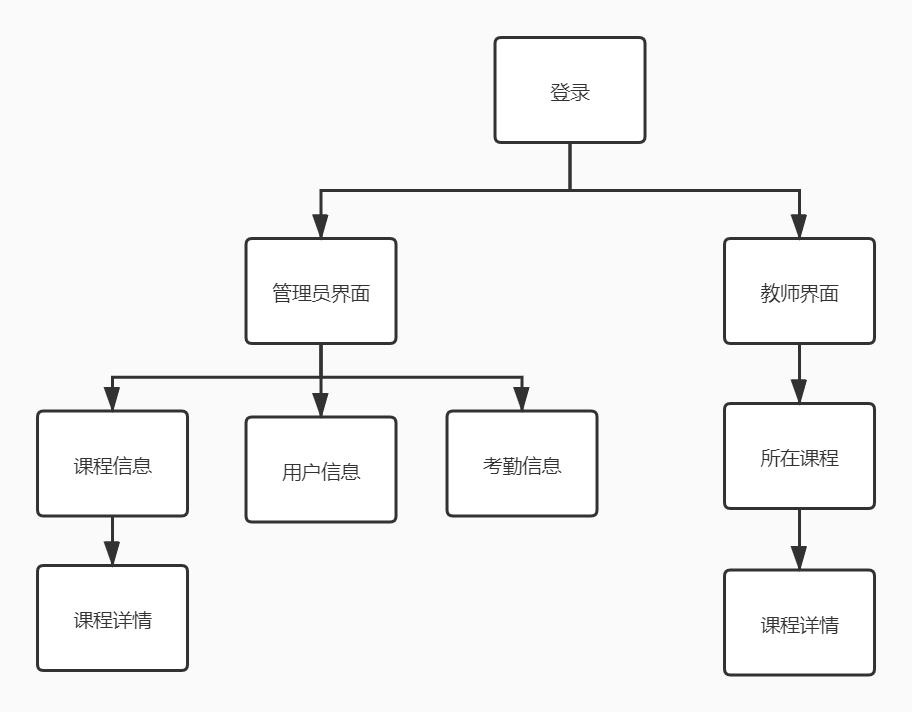
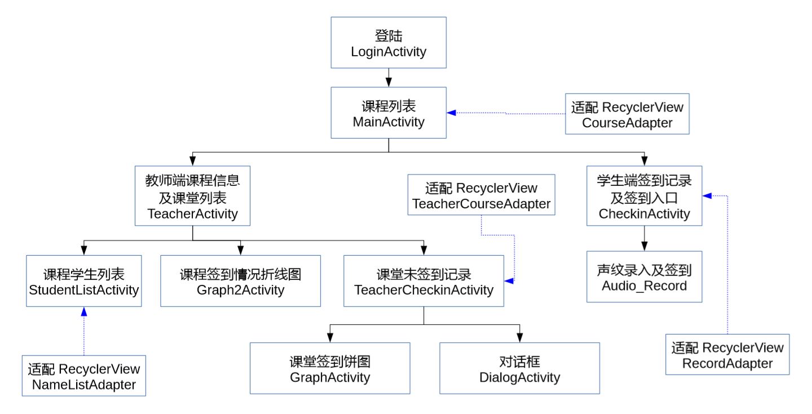
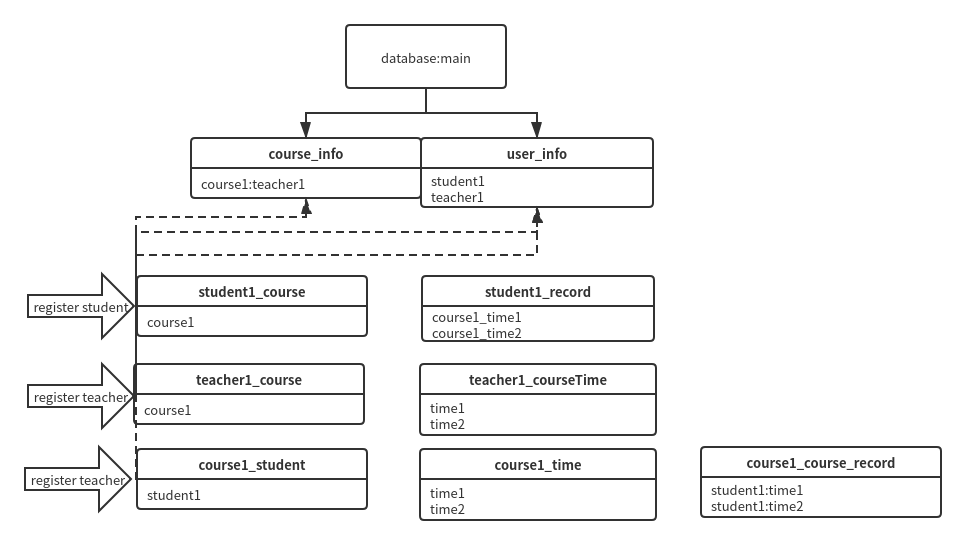

# 在鹿上大作业分析设计文档

    在鹿上组：
    李嘉尧
    常佳庆
    沈诣博
    章志宇
    刘航

##   需求分析

### 应用背景

​	目前在各大高校中，通常使用传统的方式如签到表，刷卡和刷脸进行学生签到统计，这些传统方式各有弊端。签到表较耗费人力资源，且容易出现代签，漏签的情况；刷卡虽然操作简单，但是容易出现代刷；刷脸虽然先进而且方便，但是容易出现一堆人排队刷脸，等待时间长的问题，且需要较高的硬件成本。

​	声纹识别技术，随着人工智能的发展已经日趋成熟，它具有低成本、高安全、弱隐私的优点，可以有效解决以上的问题。

### 应用场景

​	预期应用场景是大学生课堂签到，使用用户为课程的教师、学生、以及管理课程、学生、教师相关信息的教务。

### 基本功能需求

​	核心功能是实现课程签到。管理员可以添加课程、用户、学生，以保证基本的签到要素。学生可以在有效范围中完成上课的签到，系统记录每节课程课程的签到情况。教师可以查询到其任教课程学生的签到情况，考虑特殊情况，如果学生无法通过声纹正常签到，可以通过教师允许后，在教师端对学生进行补签到。可以以统计图表的方式对考勤情况进行展示，方便对课程考勤情况进行简单的管理和统计。

​	三级用户，第一级用户是教务即管理员，能够注册课程，确定课程的相关信息，包括课程时间，地点，以及课程的教师学生名单，对学生教师的信息进行增删查改。第二级用户是教师，可以查看自己任教课程的信息和签到情况。第三级用户是学生，可以对自己目前所在的课程和历史签到情况进行查看，并对目前正在进行的课程执行签到操作。

#### 签到功能

​	签到有两种方案 ：集中式签到和分布式签到。

​	集中式签到是指利用公用终端，排队进行签到，类似门禁一样，该方法不需要使用蓝牙设备定位，学生需要在规定时间在规定地点，利用规定终端完成验证。但这一方案最终被抛弃，因为与传统方案相比，完全无法体现出声纹签到的优势所在，排队现象比起人脸识别甚至会更加严重。

​	分布式签到是利用分布式的终端，规定时间规定地点进行签到。由于分布设备的移动性，该方案需要使用蓝牙定位设备，以保证签到是在规定的地点进行的。这一分布式方案，可以使用目前常见的移动端设备如手机，来进行签到验证。开发可以选用微信小程序或者APP，这一方案更符合实际需求，我们最终选定的方案是分布式签到这种方案。

#### 在线管理平台 / web 端

​	为方便管理，将管理员端/教师端的操作放在web端上，以方便在教务管理以及教师在课堂上使用电脑操作。

- 管理员
  - 管理课程信息，教师信息，学生信息
  - 管理教师账户，学生账户
  - 管理考勤记录
  - 批量上传，添加学生、教师、课程
- 教师
  - 查看任教课程信息
  - 查看课程签到情况
  - 补签到功能

#### 签到应用/安卓端

​	安卓端不只是单纯的学生端，同时也应支持教师端的功能，以方便一些课堂中没有使用电脑习惯的教师操作，如一些喜欢板书的教师和体育课。

- 教师
  - 查看任教课程信息
  - 查看课程签到情况
  - 补签到功能
- 学生
  - 查看所在课程信息
  - 对当前课程进行声纹签到
  - 查看本人考勤记录

### 泳道图

根据分析，可以画出这样的泳道图。这是一个比较典型的Client-Server模式，最终我们采用的也是这样的实现方式，前后端完全分离，将管理员，教师，学生的操作交给前端来处理，而后端则是对前端的请求进行处理操作，仅暴露相关接口给前端调用。

## 模块接口设计

### Web端

web端采用vue框架开发，整体的组件组成如下图

#### 登录界面(Login)

web端进入后默认界面，用于教师和管理员登陆，并进入相应界面

- 登录将获取用户的信息和token保存在浏览器的SessionStorage中，用于后续使用
- 使用VueRouter作为组件之间切换的工具，且设置路由守卫以免未登录即进入其它页面

###### 内部函数

| 函数名 | 参数         | 功能描述                                                     |
| ------ | ------------ | ------------------------------------------------------------ |
| login  | 用户名和密码 | 调用服务器接口，获取用户的信息和Token，保存到本地浏览器的会话存储中，根据用户的类型进入相应的主界面 |

#### 管理员界面

##### 课程信息(course_information)

用于展示目前所有课程的信息，能够对课程进行增删查改，支持批量上传

###### 内部函数

| 函数名                | 参数     | 功能描述                                                     |
| --------------------- | -------- | ------------------------------------------------------------ |
| getData               |          | 通过管理员id和登录时获得的token，调用服务器接口，返回所有的课程列表 |
| GetCourseDetail       | 课程id   | 根据课程id，跳转到对应的课程详情页                           |
| submitAddCourseDialog |          | 调用服务器接口，将前端输入的课程信息发送至服务器，添加课程   |
| submitEditDialog      |          | 调用服务器接口，将前端更改的课程信息发送至服务器，修改课程信息 |
| DeleteCourse          | 课程对象 | 调用服务器接口，根据参数的课程id，删除课程                   |
| onUploadSuccess       | 文件对象 | 在文件上传成功后，对上传的文件进行处理，得到其中所有的课程信息 |
| submitFileDialog      |          | 调用服务器接口，将上传的文件中的课程信息发送至服务器，批量添加课程 |
| DisplayCourseInfo     | 课程对象 | 根据参数的课程id，调用服务器接口，获得该课程的所有学生列表   |
| addStudentToCourse    |          | 根据前端选择的学生的id，调用服务器接口，向课程中添加学生     |
| deleteStudentInCourse |          | 根据前端选择的学生的id，调用服务器接口，删除课程中的学生     |
| EditCourseTimeDialog  | 课程对象 | 根据参数的课程id，调用服务器接口，获得该课程的所有上课时间   |
| addTimeToCourse       |          | 根据前端输入的时间，调用服务器接口，添加课程的时间           |
| deleteTimeInCourse    |          | 根据前端选中的时间，调用服务器接口，删除课程的时间           |

##### 用户信息(user_information)

展示当前所有的学生教师用户，能够进行增删查改，支持批量上传

###### 内部函数

| 函数名                  | 参数     | 功能描述                                                     |
| ----------------------- | -------- | ------------------------------------------------------------ |
| getData                 |          | 通过管理员id和登录时获得的token，调用服务器接口，返回所有的用户列表 |
| submitAddTeacherDialog  |          | 调用服务器接口，将前端输入的信息提交到服务器，添加教师       |
| submitAddStudentDialog  |          | 调用服务器接口，将前端输入的信息提交到服务器，添加学生       |
| onUploadSuccess         | 文件对象 | 在文件上传成功后，对上传的文件进行处理，得到其中所有的用户信息 |
| submitFileDialog        |          | 调用服务器接口，将上传的文件中的用户信息发送至服务器，批量添加课程 |
| submitEditTeacherDialog |          | 调用服务器接口，将前端输入的教师信息提交到服务器，更改教师信息 |
| submitEditStudentDialog |          | 调用服务器接口，将前端输入的学生信息提交到服务器，更改学生信息 |
| DisplayTeacherInfo      | 教师对象 | 根据参数的教师id，调用服务器接口，获得该教师所教的所有课程   |
| DisplayStudentInfo      | 学生对象 | 根据参数的学生id，调用服务器接口，获得该学生所在的所有课程   |
| deleteTeacher           | 教师对象 | 根据参数的教师id，调用服务器接口，删除教师账户               |
| deleteStudent           | 教师对象 | 根据参数的学生id，调用服务器接口，删除学生账户               |

##### 考勤信息(record_information)

能够查询某课程的某次课次的课程签到情况，并统计出未签到列表

###### 内部函数

| 函数名         | 参数     | 功能描述                                                     |
| -------------- | -------- | ------------------------------------------------------------ |
| getData        |          | 通过管理员id和登录时获得的token，调用服务器接口，返回所有的考勤记录 |
| openCourseInfo | 课程对象 | 调用服务器接口，通过参数的课程id获得该课程的所有签到记录     |
| openPersonInfo | 学生对象 | 调用服务器接口，根据参数的学生id获得该学生的所有签到记录     |

##### 课程详情(course_detail)

该部分用于展示课程详情，支持课程时间查询，学生的添加删除，此课程某课次未签到列表的查询

- 方便起见，由于web端教师和管理员都需要查看课程详情，所以这两部分使用的组件是同一个，根据保存的用户信息判断当前用户应该提供哪些功能

  共有：

  - 查看课程信息
  - 查看学生签到情况

  管理员：

  - 修改课程时间
  - 修改课程学生

  教师：

  - 为学生补签到

###### 内部函数

| 函数名                 | 参数     | 功能描述                                                     |
| ---------------------- | -------- | ------------------------------------------------------------ |
| getData                |          | 调用服务器接口，根据课程id获得该课程的详细信息               |
| signAStudent           | 学生对象 | 调用服务器接口，根据参数的学生id和课程id为学生补签到         |
| getStudent             |          | 调用服务器接口，根据课程id获得该课程的所有学生列表           |
| queryUnsigned          | 课程对象 | 调用服务器接口，根据课程id和开始时间获得该课程的所有未签到学生列表 |
| submitAddTimeDialog    |          | 调用服务器接口，将前端输入的课程时间提交到服务器，为该课程添加时间 |
| deleteTime             | 课程时间 | 调用服务器接口，删除课程被选中的课程时间                     |
| submitAddStudentDialog |          | 调用服务器接口，将前端输入的学生信息提交到服务器，为该课程添加学生 |
| deleteStudent          | 学生对象 | 调用服务器接口，删除课程被选中的学生                         |

#### 教师界面(Teacher_information)

用于展示当前教师任教的课程

内部函数

| 函数名            | 参数 | 功能描述                                                     |
| ----------------- | ---- | ------------------------------------------------------------ |
| getCurrtime       |      | 获取当前系统时间并格式化处理                                 |
| getData           | key  | 如果key为1，根据教师id和登录时获取的token得到该教师所教的所有课程； 如果key为2，得到该教师当前正在上的课程 |
| DisplayCourseInfo |      | 进入课程详情页                                               |

#### Web端网络接口调用

以axios为原型，将网络接口的调用统一封装为新的方法，将vue的prototype的原方法覆盖

- 单独文件配置封装网络接口请求，便于维护

- 使用json的方式传输表单内容

- 明文传输，安全性存在问题，

### Android端

安卓端整体框架结构如图

#### android学生界面
#### 模块一:LoginAcativity:登陆
 

函数名|参数|函数功能
--|--|--
onCreate|Bundle savedInstanceState|创建登陆界面，初始化调用得意音通SDK的参数，初始化界面元素。
http_Login|void|新建线程调用服务器接口登陆，根据返回信息判断登陆信息是否正确
login|void|根据用户输入的密码进行登录，调用http_login向服务器进行验证。
onBackPressed|void|重写onBackPressed，禁止该页面的回退键
onLoginSuccess|void|登陆成功的操作
onLoginFailed|void|登陆失败的操作
validate|void|检查输入的用户名和密码是否合格（是否为空，长度检测，学号为数字）
onresume|void|重写resume函数，每次回退到该界面检查权限是否被允许
 

#### 模块二:MainActivity:课程列表界面   
函数名|参数|函数功能    
--|--|--
onCreate|Bundle savedInstanceState|初始化该用户课程列表，将获取到的课程信息通过recyclerview的adapter展示到界面
http_getcourse|void|调用服务器接口获取该用户课程列表
initData|void|初始化list，异步调用http_getcourse,并用handler机制通告主线程获取课程列表完成

#### 模块三:CourseAdapter:MainActivity的适配器  
函数名|参数|函数功能    
--|--|--
CourseAdapter|List<String> list1,List<String> list2,List<String> list3|根据参数初始化课程名字，课程老师，课程介绍
getItemCount|void|返回recyclerview的规模
onCreateViewHolder|ViewGroup parent, int viewType|返回一个新的viewHolder对象
onBindViewHolder|CourseAdapter.ViewHolder holder, int position|将对应position的课程信息绑定到viewholder，并且对每一个item进行点击监听
##### 内部类：ViewHolder,作为recyclerview的总的界面框架

#### 模块四:CheckinActivity:用户签到以及签到记录界面 
函数名|参数|函数功能    
--|--|--
onCreate|Bundle savedInstanceState|初始化界面元素以及成员变量
http_getrecord|void|调用服务器接口获取该学生该课程的所有签到记录
onResume|void|重写回退函数，每当用户重新进入该界面会调用http_getrecor函数来刷新签到记录并进行必要的权限检查，最后调用getSpeakerId来获取该用户在得意音通的声纹数据库里的唯一speakerid
getSpeakerId|void|获取用户在得意音通的声纹数据库里的唯一id
checkModel|void|查看该用户是否已经建立声纹模型
sendErrorMessage|int i,String S|发送相应编号的错误类型
showToast|Context context,String msg|在参数显示在对应界面上
showAlertDialog|String title, String msg|新建一个alterdialog，标题即为参数的title，内容即为msg
dismissAlertDialog|void|删除上述创建的alterdialog界面
checkPermissions|void|检查相应权限是否打开
onRequestPermissionsResult|int requestCode,String[] permissions,int[] grantResults|重写权限回调函数，获取相应权限
onPermissionGranted|String permission|获取GPS权限
checkGPSIsOpen|void|检查GPS权限是否打开

#### 模块五:RecordAdapter:作为checkinActivity的适配器，类似上面的CourseAdapter
函数名|参数|函数功能    
--|--|--
RecordAdapter|List<String> list1,List<String> list2,List<String> list3|根据参数初始化签到时间，签到记录，课程信息
getItemCount|void|返回recyclerview的规模
onCreateViewHolder|ViewGroup parent, int viewType|返回一个新的viewHolder对象
onBindViewHolder|CourseAdapter.ViewHolder holder, int position|将对应position的课程信息绑定到viewholder，并且对每一个item进行点击监听
##### 内部类：ViewHolder,作为recyclerview的总的界面框架

#### 模块六:Audio_Record:录音
函数名|参数|函数功能    
--|--|--
onCreate|Bundle savedInstanceState|调用init函数初始化界面以及参数
init|void|初始化界面并且调用getText函数获取声纹文本
http_verifytime|void|调用服务器接口获取当前课程的签到时间并且判断当前签到时间是否合法
getText|String intentFlag|根据是录入声纹还是声纹签到分别调用对应的获取文本的接口
getblueteeth|void|获取当前ibeacon蓝牙设备的设备信息
onresume|void|重写resume函数，当录音暂停后可以继续录音
showToast|Context context,String msg|在参数显示在对应界面上
onPause|void|暂停录音
onDestroy|void|结束录音，释放录音资源
getTrainText|void|获取声纹录入的文本
getVerifyText|void|获取声纹验证的文本
verify|byte[] voice|根据录入的声音二进制文件上传到得意音通服务器进行声纹验证
uploadVoice|int index, byte[] voice|将录入的语音上传到得意音通服务器
createModel|void|未注册声纹用户根据声纹在得意音通服务器创建声纹模型
sendErrorMessage|Handler handler, int i, String s|handler发送不同的信息
startRecord|void|开始录音
stopRecord|void|结束录音
checkPermissions|void|检查权限
#### android教师界面
#### TeacherActivity

功能：显示教师端课程信息及课堂列表
父类：AppCompatActivity

| 函数名             | 参数                      | 函数功能                                                     |
| ------------------ | ------------------------- | ------------------------------------------------------------ |
| initView           | void                      | 界面初始化，绑定xml文件                                      |
| http_getcourseinfo | void                      | 通过url获取课程信息                                          |
| http_getcoursetime | void                      | 通过url获取该课程每节课堂的时间                              |
| binddata           | void                      | 绑定数据，即新建子线程调用http_getcourseinfo()和http_getcoursetime() |
| onCreate           | Bundle savedInstanceState | @Override 创建活动                                           |

 
 

#### TeacherCheckinActivity

功能：显示课堂未签到记录
父类：AppCompatActivity

| 函数名                | 参数                                         | 函数功能                                                     |
| --------------------- | -------------------------------------------- | ------------------------------------------------------------ |
| initView              | void                                         | 界面初始化，绑定xml文件                                      |
| http_getabsentstudent | void                                         | 通过url获取缺席学生                                          |
| binddata              | void                                         | 绑定数据，即新建子线程调用http_getabsentstudent              |
| http_addassign        | int studentid                                | 通过url为id为studentid的学生补签到                           |
| addassign             | int studentid                                | 补签到，即新建子线程调用http_addassign(int)                  |
| onActivityResult      | int requestCode, int resultCode, Intent data | @Override 根据type为2的对话框活动传回的是确定还是取消决定是否补签到 |
| onCreate              | Bundle savedInstanceState                    | @Override 创建活动                                           |

 
 

#### StudentListActivity

功能：显示课程学生列表
父类：AppCompatActivity

| 函数名             | 参数                      | 函数功能                                     |
| ------------------ | ------------------------- | -------------------------------------------- |
| initView           | void                      | 界面初始化，绑定xml文件                      |
| http_getallstudent | void                      | 通过url获取选修该课程的所有学生              |
| binddata           | void                      | 绑定数据，即新建子线程调用http_getallstudent |
| onCreate           | Bundle savedInstanceState | @Override 创建活动                           |

 
 

#### DialogActivity

父类：AppCompatActivity
属性：type，用于确定是哪种对话，type为1表示显示实到人数，2表示是否确认补签到，3表示显示课程总人数
组合：AlertDialog，此为Android Studio自带的对话框类

| 函数名   | 参数                      | 函数功能           |
| -------- | ------------------------- | ------------------ |
| onCreate | Bundle savedInstanceState | @Override 创建活动 |

 
 

#### GraphActivity

功能：绘制生成课堂签到饼图
父类：AppCompatActivity
组合：PieChartData，PieChartView，SliceValue，此为第三方库lecho.lib.hellocharts所有，用于画饼图及绑定数据

| 函数名   | 参数                      | 函数功能           |
| -------- | ------------------------- | ------------------ |
| onCreate | Bundle savedInstanceState | @Override 创建活动 |

 
 

#### Graph2Activity

功能：绘制生成课程签到情况折线图
父类：AppCompatActivity
组合：LineChartData，SimpleLineChartValueFormatter，Line，Axis，Viewport此为第三方库lecho.lib.hellocharts所有，用于画折线图及绑定数据

| 函数名                 | 参数                      | 函数功能                                                     |
| ---------------------- | ------------------------- | ------------------------------------------------------------ |
| initViews              | void                      | 界面初始化，绑定xml文件                                      |
| http_getcourseinfo     | void                      | 通过url获取课程信息                                          |
| http_getpresentstudent | String starttime          | 通过url获取开始时间为starttime的课堂的到场学生人数           |
| http_getcoursetime     | void                      | 通过url获取该课程每节课堂的时间                              |
| binddata               | void                      | 绑定数据，即新建子线程调用http_getcourseinfo、http_getpresentstudent、http_getcoursetime |
| initAxisXLables        | void                      | 设置x轴的显示                                                |
| initAxisPoints         | void                      | 图表每个点的显示                                             |
| initLineChart          | void                      | 生成折线图                                                   |
| onCreate               | Bundle savedInstanceState | @Override 创建活动                                           |

 
 

#### NameListAdapter

功能：适配StudentListActivity里的RecyclerView
父类：RecyclerView.Adapter<NameListAdapter.ViewHolder>

| 函数名                 | 参数                                                         | 函数功能       |
| ---------------------- | ------------------------------------------------------------ | -------------- |
| NameListAdapter        | List<String> list1, List<String> list2, List<Integer> list3, int _choise | 构造函数       |
| getItemCount           | void                                                         | 获取列表大小   |
| onCreateViewHolder     | @NonNull ViewGroup parent, int viewType                      | 创建ViewHolder |
| setOnItemClickListener | NameListAdapter.OnItemClickListener listener                 | 激活点击监听   |
| onBindViewHolder       | @NonNull final NameListAdapter.ViewHolder holder, final int position | 绑定ViewHolder |

内部类：ViewHolder
其父类：RecyclerView.ViewHolder

| 函数名     | 参数          | 函数功能 |
| ---------- | ------------- | -------- |
| ViewHolder | View itemView | 构造函数 |

 
 

#### TeacherCourseAdapter

功能：适配TeacherCheckinActivity里的RecyclerView
父类：RecyclerView.Adapter<NameListAdapter.ViewHolder>

| 函数名                 | 参数                                                         | 函数功能       |
| ---------------------- | ------------------------------------------------------------ | -------------- |
| NameListAdapter        | List<String> list1,List<String> list3                        | 构造函数       |
| getItemCount           | void                                                         | 获取列表大小   |
| onCreateViewHolder     | @NonNull ViewGroup parent, int viewType                      | 创建ViewHolder |
| setOnItemClickListener | NameListAdapter.OnItemClickListener listener                 | 激活点击监听   |
| onBindViewHolder       | @NonNull final NameListAdapter.ViewHolder holder, final int position | 绑定ViewHolder |

内部类：ViewHolder
其父类：RecyclerView.ViewHolder

| 函数名     | 参数          | 函数功能 |
| ---------- | ------------- | -------- |
| ViewHolder | View itemView | 构造函数 |

反思：所有Adapter的构成类似，但具体实现不一样，由于没有在一开始就想好需要多个Adapter，就在实践过程里一个一个加了进去，如果用更OOP的方法会好一些，不过我们总的体量也不大，负担也没有大多少。

### 服务器部分

我们的服务器有如下的三个功能部分：前后端参数调用部分、调用数据库部分，数据库接口部分。

#### 1 前后端参数调用

##### 1.1 参数调用的公有要求

1. 连接服务器需要传送的是json格式数据，返回的也是json格式的数据

2. 对于任何访问，需要如下的“公有参数”：

   * "type"，String型，指此次访问请求的类型
   * "userId"，int型，指此次访问方的用户名
   * "token"，String型，指为确保连接安全的独一无二的令牌，在登录成功后分配到用户

   相关的实现代码在`/src/com/onthedeer/server/UserServlet.java`里。在判断是否存在三个参数之后，继续操作或者返回错误信息。

##### 1.2 不同功能和其对应的参数调用

​	服务器和前端交互部分对应的功能和额外参数列举如下：

   * "login"：用户登录

     需要额外参数如下：

     * "username"，姓名
     * "password"，密码

     如果登录成功，则会以json的形式返回用户信息。返回的用户信息参数如下：

     * "user_id"，用户id
     * "user_Username"，用户姓名
     * "user_Password"，用户密码
     * "user_Gender"，用户性别，1为男性2为女性3为其它
     * "user_Department"，用户院系
     * "user_Birthday"，用户生日
     * "user_HaveVoice"，用户是否已有录音，1为没有2为有
     * "user_Rank"，用户类别，（学生:1 教师:2 管理员:3）
     * "newToken"，服务器返回的随机生成独一无二的token，该token需在之后用户的操作中用到。

     它们的类型都是String。

     如果登录失败，则会返回相应的错误信息。

   * "registerUser"：管理员注册用户

     该接口是批量操作接口，其额外参数如下：

     * “content”，jsonarray型参数，其中的每个成员代表添加的一个用户，参数如下：
       * "rank"，int型，用户类别
       * "id"，int型，用户id
       * "username"，String型，用户姓名
       * "password"，String型，用户密码
       * "gender"，int型，用户性别
       * "department"，String型，用户院系
       * "birthday"，String型，用户生日
     * “maxrank”，int型参数，代表这一批用户的最大权限。

   * "registerCourse"：管理员注册课程

     该接口是批量操作接口，其额外参数如下：

     - “content”，jsonarray型参数，其中的每个成员代表添加的一个课程，参数如下：

       - "id"，int型，课程id

       - "TeacherId"，int型，授课教师id

       - "room"， String型，课程教室

       - "coursename"， String型，课程名称

       - "students"，jsonarray型，课程的学生们

         "students"的各个成员代表每一个学生，它们都只有一个int型参数："studentId"，即学生的id。

   * "modifyUserInfo"：管理员改变用户信息

     需要的额外参数如下：

     * "id"，int型，用户的id
     * "password"，string型，更改后的密码
     * "department"，string型，更改后的院系
     * "birthday"，string型，更改后的生日

   * "modifyCourseInfo"：管理员改变课程信息

     需要的额外参数如下：

     * "id"，int型，课程的id
     * "teacherid"，int型，新教师的id
     * "capacity"，int型，课程新的容量
     * "classroom"，string型，课程新的教室

   * "setCourseTime"：管理员增加/删除一项课程的时间

     需要的额外参数如下：

     * "id"，int型，课程id
     * "modifyType"，int型，操作类型：0为删除操作，1为添加操作
     * "classtime" ，jsonarray型，每一个成员的参数如下：
       * "start_time"，String型，"YY-mm-dd hh:MM:ss"格式的课程开始时间
       * "end_time"，String型，同样格式的课程结束时间

   * "registerStudent2Course"：管理员将学生添加到课程中

     需要的额外参数如下：

     * "studentId"，int型，学生编号
     * "courseId"，int型，课程学生编号

   * "deleteStudent2Course"：管理员将学生移除出课程，参数和"registerStudent2Course"完全一致

   * "assign"：学生签到，不需要额外参数，后台判断当前时间并完成签到工作。

     返回信息的参数如下，变量均为String型：

     * "course_time_start"，签到课程的开始时间
     * "course_time_end"，签到课程的截止时间
     * "course_id"，签到课程的id名称
     * "course_name"，签到课程的课程名
     * "student_assign"，学生签到情况，为"1"(已签到)

   * "deleteCourse"：管理员删除课程

     需要的额外参数如下：

     * "courseId"，int型，课程id

   * "deleteUser"：管理员删除用户

     需要的额外参数如下：

     * "deleteId"，int型，用户id

   * "getAllCourses"：管理员得到全部课程，不需要额外参数

     返回信息的额外参数只有一个jsonarray类型的"contents"参数，每一个成员描述一门课程，成员的参数如下，均为String类型：

     * "course_id"，课程名字
     * "course_TeacherId"，老师id
     * "course_Teachername"，老师名字
     * "course_Capacity"，课程容量
     * "course_Room"，课程教室
     * "course_name"，课程名字

   * "getAllUsers"：管理员得到全部非管理员用户，不需要额外参数

     返回信息的额外参数只有一个jsonarray类型的"contents"参数，每一个成员描述一个用户，成员的参数如下，均为String类型：

     * "user_id"，用户id
     * "user_Username"，用户姓名
     * "user_Password"，用户密码
     * "user_Gender"，用户性别，1为男性2为女性3为其它
     * "user_Department"，用户院系
     * "user_Birthday"，用户生日
     * "user_HaveVoice"，用户是否已有录音：1为没有，2为有
     * "user_Rank"，用户类别：（学生:1 教师:2 管理员:3）

   * "getRecordByStudent"：管理员或学生本人得到一个学生的所有签到记录

     需要额外参数如下：

     * "studentId"，int型，学生id

     返回信息的额外参数只有一个jsonarray类型的"contents"参数，每一个成员描述一个记录，成员的参数如下，均为String类型：

     - "course_time_start"，签到课程的开始时间
     - "course_time_end"，签到课程的截止时间
     - "course_id"，签到课程的id名称
     - "course_name"，课程的名称
     - "student_assign"，学生签到情况，1为签了0为没签

   * "getRecordByCourse"：管理员或该课程老师得到课程的所有签到记录

     需要额外参数如下：

     - "courseId"，int型，课程id

     返回信息的额外参数只有一个jsonarray类型的"contents"参数，每一个成员描述一个记录，成员的参数如下，均为String类型：

     - "course_time_start"，签到课程的开始时间
     - "course_time_end"，签到课程的截止时间
     - "student_id"，学生的id名称
     - "student_name"，学生的姓名
     - "student_assign"，学生签到情况，1为签了0为没签

   * "getAllStudentByCourse"：管理员或课程教师得到一门课程全部的学生

     需要额外参数如下：

     - "courseId"，int型，课程id

     返回信息的额外参数只有一个jsonarray类型的"contents"参数，每一个成员描述一个学生，成员的参数如下，均为String类型：

     * "student_id"，学生id
     * "student_name"，学生姓名
     * "student_assign"，学生总共签到次数

   * "getNotAssignedStudent"：管理员或者任课教师查看一节课没有到的学生

     需要的额外参数如下：

     * "courseId"，课程id
     * "start_time"，String型，课程开始时间

     返回信息的额外参数只有一个jsonarray类型的"contents"参数，每一个成员描述一个未签到的学生，成员的参数如下，均为String类型：

     - "course_time_start"，签到课程的开始时间
     - "course_time_end"，签到课程的截止时间
     - "student_id"，学生的id名称
     - "student_name"，学生的姓名
     - "student_assign"，学生签到情况，1为签了0为没签

   * "getOngoingClass"：教师查看正在上着的课

     需要的额外参数如下：

     * "timenow"，String型，当下时间

     返回的参数如下，均为String型：

     * "course_time_start"，课程开始时间
     * "course_time_end"，课程结束时间
     * "course_id"，课程编号
     * "course_name"，课程名称

   * "getCourseInfo"：查看某个课程的所有信息

     需要的额外参数如下：

     * "id"，int型，课程id

     如下的返回参数均为String型：

     * "course_id"，课程id    
     * "course_TeacherId"，教师id
     * "course_Teachername"，教师名字
     * "course_Capacity"，参与课程学生数
     * "course_Room"，课程教室
     * "course_name"，课程名字

     返回信息的额外参数还有一个jsonarray类型的"classtime"参数，每一个成员描述一次课程的时间，成员的参数如下，均为String类型：

     - "course_time_start"，课程开始时间
     - "course_time_end"，课程结束时间

   * "teacherAddAssign"：教师对学生补签到

     需要的额外参数如下：

     * "studentId"，int型，学生id
     * "courseId"，int型，教师id
     * "registerTime"，String型，"YY-mm-dd hh:MM:ss"格式的课程开始时间

     返回参数如下，均为String型：

     - "course_time_start"，签到课程的开始时间
     - "course_time_end"，签到课程的截止时间
     - "course_id"，签到课程的id名称
     - "course_name"，签到课程的课程名
     - "student_assign"，学生签到情况，为"1"(已签到)

   * "getCourseTime"：查看某个课程的所有时间

     需要的额外参数如下：

     * "courseId"，int型，代表课程id

     返回信息的额外参数只有一个jsonarray类型的"contents"参数，每一个成员描述一次课程的时间，成员的参数如下，均为String类型：

     - "course_time_start"，每一节课的开始时间
     - "course_time_end"，每一节课的结束时间

   * "getEveryCourseInfo"：管理员或用户本人得到全部的课程

     需要的额外参数如下：

     * ”getId”，int型参数，表示用户的id

     返回信息的"contents"参数内记录如下，除最后一条之外均为String类型：

     返回信息的额外参数只有一个jsonarray类型的"contents"参数，每一个成员描述一门课程的信息，成员的参数如下，除最后一条外均为String类型：

     - "course_id"，课程名字
     - "course_TeacherId"，老师id
     - "course_Teachername"，老师名字
     - "course_Capacity"，参与课程人数
     - "course_Room"，课程教室
     - "course_name"，课程名字
     - "classtime"，jsonarray型，其每一个成员描述一节课的时间，拥有参数如下，均为String类型：
       - "course_time_start"，课程开始时间
       - "course_time_end"，课程结束时间

   * "getAssignClassRecord"：管理员或者任课教师或者学生本人查看一个学生所有课次的签到情况

     需要的额外参数如下：

     * "courseId"，int型，课程id
     * "studentId"，int型，学生id

     返回信息的额外参数只有一个jsonarray类型的"contents"参数，每一个成员描述一门课程的信息，成员的参数如下，均为String类型：

     - "course_time_start"，签到课程的开始时间
     - "course_time_end"，签到课程的截止时间
     - "course_id"，签到课程的id名称
     - "course_name"，课程的名称
     - "student_assign"，学生签到情况，1为签了0为没签

   * "logout"：登出，不需要任何额外参数。

   对于所有请求，返回的json里都会采用"message"参数值来传递操作的结果，提示成功与否和失败原因。该参数为String类型

相关的实现代码在`/src/com/onthedeer/server/UserServlet.java`里。

#### 2 数据库调用

这部分的实现代码在`/src/com/onthedeer/server/UserService.java`里。在这部分里面我定义了增删查改的各种规则，在数据库里建立起了表的机制。

具体函数要不要写呢？

数据库中的所有数据都存储在main库下，存在两个常表格course_info和user_info，记录所有的课程和用户。

对于注册的每一个学生，存储两个表：一个名字为：学生ID+”\_course”，存储学生所有的课程；另一个名字为：学生ID+“\_record”，存储学生每一个课程每一堂课的签到记录。

对于注册的每一个教师，存储两个表：一个名字为：教师ID+“\_course”，存储教师所有的课程；另一个名字为：教师ID+“\_record”，存储教师的每一课程的所有上课时间。

对于注册的每一节课程，存储三个表：一个名字为：课程ID+“\_student”，存储课程所有的学生；另一个名字为：课程ID+“\_time”，存储课程所有的时间；第三个名字为：课程ID+“\_course\_record”，存储课程所有的学生的每一堂课签到记录。

这样就可以完成所有的增删改查功能：当新建对象的时候，根据对象的类型（课程，教师，学生）来决定新建表的类型，数量并且插入表；删除/修改对象的时候，通过对象的ID作为索引来维护不同的表；查找对象的时候，可以用两个info表作为索引快速定位对象。对于常用的签到操作，可以使用时间和学生ID作为索引，从record中查找到当前课程完成签到，并且更新课程表格。